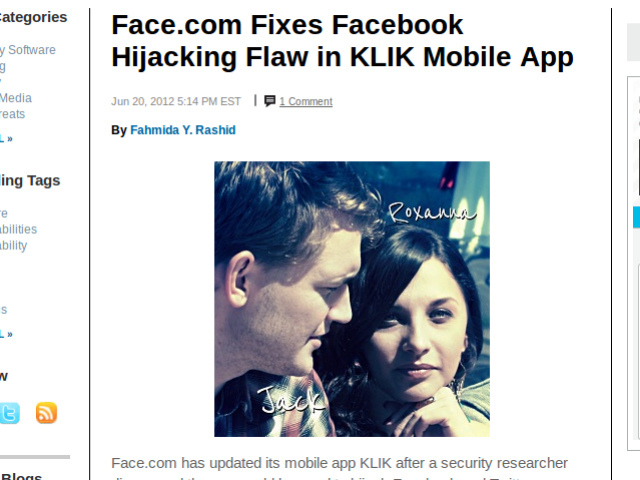

!SLIDE bullets
# Dwolla OAuth2
* [1. Get a Token](https://developers.dwolla.com/dev/pages/auth#oauth-token)
* [2. Use a Token](https://developers.dwolla.com/dev/docs/transactions/send)

!SLIDE center

!SLIDE center
# [@nov](https://twitter.com/nov)

!SLIDE center
# Bearer Example Project
* [rack-oauth2](https://github.com/nov/rack-oauth2-sample)

!SLIDE center
# Mailing List
* [rack-oauth2](https://groups.google.com/forum/?fromgroups#!forum/rack-oauth2)

!SLIDE bullets
# OAuth 2 Security 
* [OAuth 2 Threat Model and Security Considerations](http://tools.ietf.org/html/rfc6819)

!SLIDE bullets
# [4.4.2 Implicit Grant](http://tools.ietf.org/html/rfc6819#section-4.4.2)
* [4.4.2.6 Threat: Token substitution (OAuth Login)](http://tools.ietf.org/html/rfc6819#section-4.4.2.6)

!SLIDE center
# Lure victim to evil app...

!SLIDE center
# ...or victims

